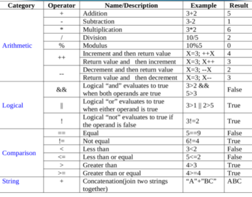

# Week 7: Tuesday - CSS + JavaScript
## CSS
### **Bootstrap
- front-end framework for building responsive websites quickly  

*Contains many built-in features to make building a website easier + quicker*  

Core Features
1. Customizable despite the built-in features
2. Makes a website responsive
3. Doesn't require a deep understanding of CSS
4. Large community to help
5. Develops websites quickly
6. Supported in many browsers  

Adding Bootstrap to File
- download the [file](http://getbootstrap.com/)
```
<head>
 	<title>The Bootstrap Example</title> 
  <link href=”bootstrap/css/bootstrap.min.css” rel=”stylesheet” type=”text/css” />
  <script type=”text/javascript” src=”bootstrap/js/bootstrap.min.js”></script>
</head>
```

- create link tag w/ the bootstrap CDN  
```
	<head>
 		<title>The Bootstrap Example</title> 
<link rel="stylesheet" href="https://stackpath.bootstrapcdn.com/bootstrap/4.3.1/css/bootstrap.min.css" integrity="sha384-ggOyR0iXCbMQv3Xipma34MD+dH/1fQ784/j6cY/iJTQUOhcWr7x9JvoRxT2MZw1T" crossorigin="anonymous">

<script src="https://stackpath.bootstrapcdn.com/bootstrap/4.3.1/js/bootstrap.min.js" integrity="sha384-JjSmVgyd0p3pXB1rRibZUAYoIIy6OrQ6VrjIEaFf/nJGzIxFDsf4x0xIM+B07jRM" crossorigin="anonymous"></script>

	</head>
```

Using Bootstrap Objects
```
<div class = "exampleObject"></div>
```
- object passed as a value to the class attribute  
- *the object passed determines what will be displayed on the web page*
  - i.e. class = "jumbotron" -> creates jumbotron  

## JavaScript
- programming language to make web pages more dynamic  

*The capabilities of JavaScript depends on the environment it is in (i.e. Node or Browser)*  

### **Data Types**
- Number
  - Integer: whole nums
  - Float: nums w/ decimals
- String: text
- Boolean: true || false
- Null: no value
- Undefined: no value
- Objects  

### **Variables**
- name for memory location to access data stored  

Syntax
```
var example1;

let example2;
const PI = 3.14;
```
- const variables cannot change value
- *Use let or const bc they are block scoped + must be declared b4 use*  

### **Operators**
  

Operator Precedence
- operators are executed in a specific order
- operators within () are always executed first  

Arithmetic Tricks
```
let num = 0;
num++; // 1
++num; // 1

let num += 1; // reassign + add 1 at the same time
```
- first one can also be --
- second one works w/ other arithmetic operators as well  

### **Comments**
- allow us to place text in our JavaScript code
- ignored by JS interpreter -> doesn't affect our code

*Has many purposes: explanations, notes, etc*  

Syntax
```
// single-line comment

/*
  multiple
  line
  comment
*/
``` 

### **Concatenation**
- combing 2+ strings  

*There are multiple ways to combine strings.*  

1 Example
```
"This string " + "will join this string.";
```
- uses + to concat the strings  

### **Conditional Statements**
- if
- if/else
- if/else if
- switch  

### **Loops**
- while()
- for()
- do while()